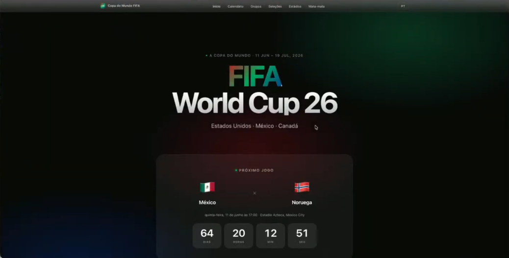

# ⚽ Copa do Mundo 2026 — Fan Hub

Site informativo e estatístico da Copa do Mundo FIFA 2026 (EUA · México · Canadá), construído com HTML, CSS e JavaScript puros — sem frameworks, sem bundler, sem dependências de backend.



---

## ✨ Features

### Seções públicas
| Seção | Descrição |
|-------|-----------|
| **Home** | Hero com tipografia gigante, countdown regressivo ao vivo para o próximo jogo e feed de partidas filtrado por fase |
| **Jogos** | Calendário completo das 104 partidas com filtros por fase e grupo |
| **Grupos** | Tabelas de classificação dos 12 grupos (A–L) com destaque de classificados |
| **Seleções** | Grid das 48 seleções com detalhe de elenco, stats, histórico de títulos e confrontos diretos |
| **Estatísticas** | Artilharia do torneio, ranking por seleção e comparativo Head-to-Head interativo |
| **Histórico** | Todas as 22 edições da Copa (1930–2022), ranking de campeões e recordes |
| **Sedes** | 16 estádios em EUA, México e Canadá com capacidade e jogos por arena |

### Área de Membros (🔐 login obrigatório)
| Aba | Dados | Conteúdo |
|-----|-------|---------|
| **Dashboard** | `WorldCups.csv` | 4 stat cards + 4 gráficos interativos (Chart.js) |
| **Partidas** | `WorldCupMatches.csv` | 4.572 partidas históricas (1930–2014) com filtros e paginação |
| **Artilheiros** | `WorldCupPlayers.csv` | Top 50 artilheiros calculados de ~37.000 registros |

> **Acesso demo:** usuário `demo` · senha `copa2026`

---

## 🛠 Stack

- **HTML5** — shell estático em `index.html`
- **CSS3** — variáveis, grid, `backdrop-filter`, `@keyframes`; fontes via Google Fonts (Barlow Condensed + Space Grotesk)
- **JavaScript ES Modules** — roteamento por hash, `dynamic import()`, `fetch()` para dados estáticos
- **[Chart.js 4.4](https://www.chartjs.org/)** — gráficos da área de membros (CDN, sem instalação)
- **[FlagsAPI](https://flagsapi.com/)** — imagens de bandeiras por código ISO 3166-1 alpha-2
- **Zero bundler** — nenhum Node.js, npm ou processo de build necessário

---

## 📁 Estrutura

```
WorldCups_02/
├── index.html              # Shell único — toda a navegação é client-side
│
├── js/
│   ├── router.js           # Roteamento hash → dynamic import → render()
│   ├── utils.js            # fetchJSON, formatDate, getFlagImg, getCountryFlagImg, sortStandings…
│   ├── auth.js             # Login/logout com sessionStorage
│   └── csv-parser.js       # Parser CSV com suporte a campos entre aspas
│
├── sections/               # Uma função render(container) por seção
│   ├── home.js
│   ├── jogos.js
│   ├── grupos.js
│   ├── selecoes.js
│   ├── estatisticas.js
│   ├── historico.js
│   ├── sedes.js
│   └── membros.js          # Área restrita (login + gráficos + CSV)
│
├── styles/
│   ├── main.css            # Tokens de design, header, body atmosférico
│   ├── nav.css             # Tab navigation glass
│   ├── components.css      # Todos os componentes reutilizáveis
│   └── membros.css         # Estilos exclusivos da área de membros
│
├── data/                   # JSON estático da Copa 2026
│   ├── jogos.json          # 104 partidas (72 grupos + 32 mata-mata)
│   ├── grupos.json         # 12 grupos com classificações
│   ├── selecoes.json       # 48 seleções com elencos e stats
│   ├── historico.json      # 22 edições 1930–2022
│   ├── sedes.json          # 16 estádios
│   └── artilharia.json     # Artilheiros do torneio 2026
│
└── data_csv/               # Dados históricos brutos (Kaggle)
    ├── WorldCups.csv        # 20 edições — resultados, gols, público
    ├── WorldCupMatches.csv  # 4.572 partidas 1930–2014
    └── WorldCupPlayers.csv  # ~37.000 registros de jogadores
```

---

## 🚀 Como rodar

O site usa `fetch()` e ES Modules nativos, portanto **não pode ser aberto via `file://`** — é necessário um servidor HTTP local.

### Opção 1 — live-server (recomendado, recarrega ao salvar)
```bash
npx live-server .
```

### Opção 2 — Python
```bash
# Python 3
python -m http.server 8080

# Python 2
python -m SimpleHTTPServer 8080
```

### Opção 3 — VS Code
Instale a extensão **Live Server** e clique em *"Go Live"* na barra de status.

Depois acesse `http://localhost:8080` (ou a porta exibida) no navegador.

---

## 🎨 Design

O design segue a direção **Copa Vibrante × Execução Premium**:

- **Fundo:** `#080910` com bleeding atmosférico radial vermelho/azul fixo
- **Vermelho Copa:** `#E8002D` — accent primário, borders de hover, artilheiros
- **Azul Copa:** `#0033A0` — gradient secundário, gráfico de público
- **Dourado:** `#FFD700` — tabs ativas, pontos, números de destaque
- **Tipografia display:** Barlow Condensed (headings, números grandes)
- **Tipografia corpo:** Space Grotesk (texto corrido, UI)
- **Glass cards:** `rgba(255,255,255,0.025)` + `backdrop-filter: blur`
- **Animações:** `fadeUp` na entrada de cada seção

---

## 📊 Dados

### Copa 2026 (JSON — `data/`)
Coletados e estruturados manualmente a partir de fontes oficiais:
- Sorteio real de dezembro de 2025 (grupos A–L com 48 seleções)
- 104 jogos com datas, horários e sedes reais
- 16 estádios com capacidades verificadas
- Elencos de 25 jogadores por seleção

### Histórico (CSV — `data_csv/`)
Dataset público do [Kaggle — FIFA World Cup](https://www.kaggle.com/datasets/abecklas/fifa-world-cup):
| Arquivo | Linhas | Conteúdo |
|---------|--------|---------|
| `WorldCups.csv` | 20 | Edição, sede, campeão, vice, gols, público |
| `WorldCupMatches.csv` | 4.572 | Todas as partidas com placares e estádios |
| `WorldCupPlayers.csv` | ~37.800 | Jogadores, posições e eventos (gols, cartões) |

---

## 🔒 Área de Membros

A autenticação é **client-side apenas** (adequada para demo/protótipo):

- Credenciais definidas em `js/auth.js` no objeto `USERS`
- Sessão mantida em `sessionStorage` (expira ao fechar a aba)
- Para adicionar usuários: edite `USERS` em `js/auth.js`

```js
// js/auth.js
const USERS = {
  demo:  'copa2026',
  admin: 'suasenha',   // adicione aqui
}
```

> ⚠️ Não use este modelo de autenticação em produção com dados sensíveis.

---

## 🌐 Deploy

O projeto é 100% estático — pode ser publicado em qualquer CDN ou host de arquivos:

- **GitHub Pages** — vá em *Settings → Pages → Deploy from branch*
- **Vercel** — importe o repositório, deixe o framework como "Other"
- **Netlify** — arraste a pasta para o dashboard de deploy

---

## 📜 Licença

MIT — use, modifique e distribua à vontade.
